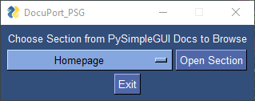
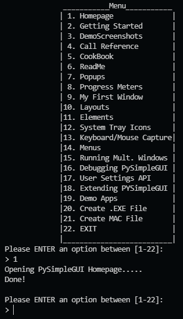

# DocuPort PSG v2.1.0

---

> _A PySimpleGUI Online Documentation Portal_

[PySimpleGUI](https://pysimplegui.readthedocs.io/en/latest/) is an _excellent_ framework for building GUIs quickly, and with ease. Unfortunately, PSG doesn't have any _official_ offline documentation that can be easily downloaded. Instead, the documentation is hosted _online_, where it is changed and updated quite frequently - which is part of the reason the creator maintains the documentation online only.

As a result, users must go online anytime the documentation is needed, which is rather often as stated by the dev(s) themselves. So I decided to create a simple application that can
take users to specific areas of the online documentation quickly, and with the click of a
button. Thus, out of my own laziness and disdain for digging through webpages, **DocuPort_PSG** was born.

---

## How to use DocuPort PSG

---

- Using the application is about as simple can be:
  - Simply open the application, and choose a section to browse.
    - _The color scheme of the window will be different each time the window is opened._
  - Click on the desired section, and the app will open the documentation in your default browser automatically.
    - You can open as many pages/chapters as you\'d like, and the app will remain open.
  - To exit or close the app, simply click the "X" at the top of the screen, or the "Exit" button at the bottom of the window.
  - That's it!

    

---

## How to use DocuPort PSG - CLI

---

> _Introduced with v2.0.1 update_

- The command-line-interface version of the application is entirely self explanatory through on-screen directions.
- Simply follow the instructions displayed on screen, and you'll be fine!
- The URL menu is re-printed to the console every **5** user-inputs, or if an incorrect input is entered, aka **anything that is not between [1-22]**.

  

---
