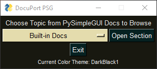

# DocuPort - PySimpleGUI

> - _A PySimpleGUI Online Documentation Portal_

---

## About

---

[PySimpleGUI](https://pysimplegui.readthedocs.io/en/latest/) is an _excellent_ framework for building GUIs quickly, and with ease. Unfortunately, **_PSG_** doesn't have any _official_ offline documentation that can be easily downloaded. Instead, the documentation is hosted _online_, where it is changed and updated quite frequently - this being the primary reason for the creator maintaining the documentation online _only_.

As a result, users must go online anytime the documentation is needed, which is rather often as stated by the dev(s) themselves. So I decided to create a simple application that can take users to specific areas of the online documentation quickly, and with the click of a button. Thus, out of my own laziness and disdain for digging through webpages, **DocuPort PSG** was born!

---

## How to use DocuPort PSG - **GUI Version**

---

- _Using the application is about as simple can be:_

  - Simply open the application, and choose a section to browse.
    - _The color scheme of the window will be different each time the window is opened._
  - Click on the desired section, and the app will open the documentation in your default browser automatically.
    - You can open as many pages/chapters as you wish, and the app will remain open.
  - **_DocuPort PSG_** is always shown on top of other open windows to prevent the need to continuously minimize/maximize/re-size/close your browser window when researching through _multiple_ sections.
  - To exit or close the app, simply click the "X" at the top of the screen, or the "Exit" button at the bottom of the window.
  - **_That's it!_**

    

    

---

## How to use DocuPort PSG - **CLI Version**

---

> _Introduced in v2.0.1b update_

- The command-line-interface version of the application is entirely self explanatory through on-screen directions.
- Simply follow the instructions displayed on screen, and you'll be fine!
- The URL menu is **re-printed to the console every 5 user-inputs, or if user-input is anything that is not between [1-22]** _(e.g. if an incorrect input is entered)_.

  

---
